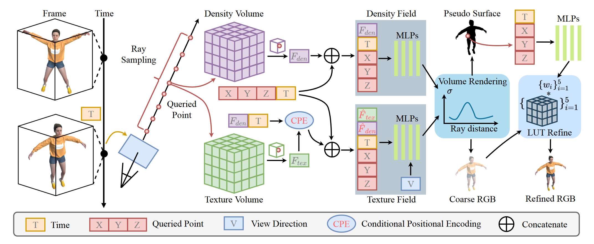
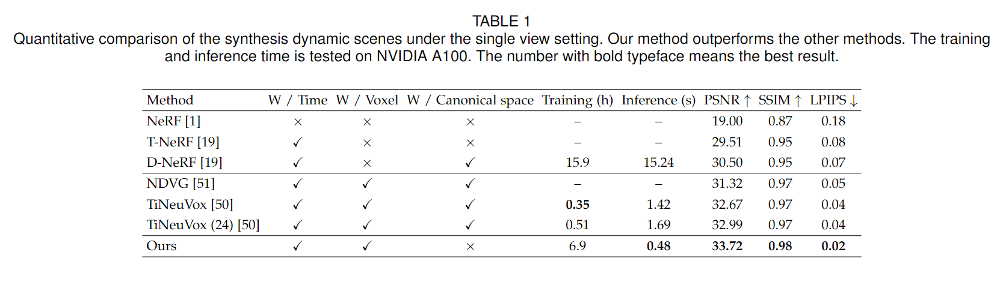
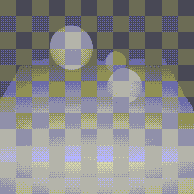
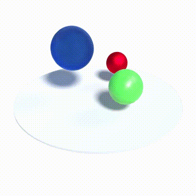

# V4D: Voxel for 4D Novel View Synthesis
## TVCG (2023)

### [Arxiv paper](https://arxiv.org/abs/2205.14332) 
### [TVCG Preview](https://ieeexplore-ieee-org.utokyo.idm.oclc.org/abstract/document/10239492?casa_token=TU1WtbBosNsAAAAA:mcGljcO8q31pwB17S1F5hxtK48HHDRC4PQxfgnk-RuhDCF8ha2xnfCvSCawjxMeVbyG3djwZdQ)
[V4D: Voxel for 4D Novel View Synthesis](https://github.com/GANWANSHUI/V4D)   
[Wanshui Gan]()<sup></sup>, [Hongbin Xu]()<sup></sup>, [Yi Huang]()<sup></sup>, [Shifeng Chen]()<sup></sup>, [Naoto Yokoya]()  

---------------------------------------------------

[//]: # (![block]&#40;./imgs/render_demo.gif&#41;   )

[//]: # (Our method converges very quickly. This is a comparison between D-NeRF &#40;left&#41; and our method &#40;right&#41;. )



Neural radiance fields have made a remarkable breakthrough in the novel view synthesis task at the 3D static scene. However, for the 4D circumstance (e.g., dynamic scene), the performance of the existing method is still limited by the capacity of the neural network, typically in a multilayer perceptron network (MLP). In this paper, we utilize 3D Voxel to model the 4D neural radiance field, short as V4D, where the 3D voxel has two formats. The first one is to regularly model the 3D space and then use the sampled local 3D feature with the time index to model the density field and the texture field by a tiny MLP. The second one is in look-up tables (LUTs) format that is for the pixel-level refinement, where the pseudo-surface produced by the volume rendering is utilized as the guidance information to learn a 2D pixel-level refinement mapping. The proposed LUTs-based refinement module achieves the performance gain with little computational cost and could serve as the plug-and-play module in the novel view synthesis task. Moreover, we propose a more effective conditional positional encoding toward the 4D data that achieves performance gain with negligible computational burdens. Extensive experiments demonstrate that the proposed method achieves state-of-the-art performance at a low computational cost.
## Notes
* *July. 20, 2023* The first and preliminary version is realeased. Code may not be cleaned thoroughly, so feel free to open an issue if any question.


## Requirements
* lpips
* mmcv
* imageio
* imageio-ffmpeg
* opencv-python
* pytorch_msssim
* torch
* torch_scatter

## Data Preparation
**For synthetic scenes:**  
The dataset provided in [D-NeRF](https://github.com/albertpumarola/D-NeRF) is used. You can download the dataset from [dropbox](https://www.dropbox.com/s/0bf6fl0ye2vz3vr/data.zip?dl=0). Then organize your dataset as follows.

**For real dynamic scenes:**  
The dataset provided in [HyperNeRF](https://github.com/google/hypernerf) is used. You can download scenes from [Hypernerf Dataset](https://github.com/google/hypernerf/releases/tag/v0.1) and organize them as [Nerfies](https://github.com/google/nerfies#datasets).

Change the relative base path in the configs in the code to match your data structure.

```
├── data
│   ├── nerf_synthetic
│   ├
│   ├── real
```


## Train and evaluation
For training synthetic scenes, such as `trex`, run 
``` 
basedir = Path for save
python run.py --config configs/dynamic/synthesis/trex.py --render_test --basedir $basedir
```
set `--video_only` to generate the fixed time, fixed view, and novel view time video, we have not tested this function on real scenes yet.

For training real scenes, such as `broom`, run 
``` 
basedir = Path for save
python run.py --config configs/dynamic/real/broom.py --render_test --basedir $basedir
``` 

<details>
<summary> Some messages for the training </summary>

1. The tv loss is now implemented on the original Pytorch, and the training time may vary by around 1 hour for each independent training. For now, we did not investigate it further and we report the fastest training time. We try to use the cuda version from [DirectVoxGO] to achieve faster training, but with the performance drop on some scenes, which still need to finetune the hyperparameter of the weight.

2. At present, the result on the paper is with the 4196 rays for training, if you change with larger number like 8196, the network could achieve obvious performance gain, but with longer training time!

3. We provide the fine box for synthesis dataset. You can set the **search_geometry** to True if you want to calculate it by yourself.

</details>


## Main Results   
All the source results can be found in this [link.](https://www.dropbox.com/sh/xl27jroucyts8vw/AABhxGL9UmhyYFSwdXZBwWAra?dl=0)

### Synthetic Scenes



<p align='center'>


</p>

[//]: # (### Real Dynamic Scenes)

[//]: # (![block]&#40;./imgs/Table 2.png&#41;)

## Acknowledgements
This repository is partially based on [DirectVoxGO](https://github.com/sunset1995/directvoxgo), [TiNeuVox](https://jaminfong.cn/tineuvox) and [D-NeRF](https://github.com/albertpumarola/D-NeRF). 
Thanks for their awesome works.


## Citation
If you find this repository/work helpful in your research, welcome to cite the paper and give a ⭐.
```
@article{gan2023v4d,
  title={V4d: Voxel for 4d novel view synthesis},
  author={Gan, Wanshui and Xu, Hongbin and Huang, Yi and Chen, Shifeng and Yokoya, Naoto},
  journal={IEEE Transactions on Visualization and Computer Graphics},
  year={2023},
  publisher={IEEE}
}
```
